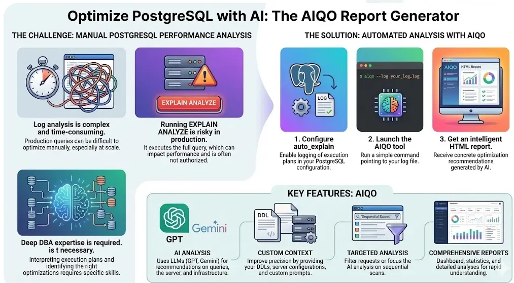

# AIQO PostgreSQL AI Report Generator

The AIQO PostgreSQL AI Report Generator is a powerful command-line tool designed to analyze PostgreSQL `auto_explain` logs using Artificial Intelligence. It provides query tracking over time and actionable insights and optimization suggestions to improve database performance, presenting its findings in a comprehensive HTML report.

It is well suited to scenarios where complexity, data volume and fragmentation make it difficult or impossible to reproduce the execution plan outside the production environment.

[](URL-REPORT-VIRUSTOTAL) [Sample HTML report here](docs/sample_report.zip?raw=true) ([VirusTotal Report](https://www.virustotal.com/gui/file/7acb0c7def7ae27d556efe4309ce0268ab1d30456a4e3577e976001d6635c2fd?nocache=1)), for a randomized dataset created using explain.dalibo.com sample plans. AI hint is at day may 4, real reports are more meaningful due to detailed context you can provide to AI analisys. 



## Features

*   **Query Code Tracking**: Generates a unique "query code" (hash) for each normalized SQL query, enabling consistent tracking and application of query-specific optimizations across different log executions.
*   **AI-Powered Analysis**: Leverages large language models (LLMs) to analyze `EXPLAIN` plans from PostgreSQL logs and identify performance bottlenecks. Provides concrete recommendations for query, server, and infrastructure optimizations based on AI analysis.
*   **Flexible Contextualization**: Allows users to provide DDL, server configuration, infrastructure details, and custom prompts to enhance AI analysis accuracy.   
*   **Comprehensive HTML Reports**: Generates detailed, easy-to-read HTML reports summarizing performance metrics, AI findings and optimization opportunities.
*   **Customizable AI Models**: Supports various AI providers and models (e.g. ChatGPT, Gemini, DeepSeek, ...) via `litellm`.
*   **Query Filtering**: Filter log entries based on specific strings to analyze only relevant queries.
*   **Multilingual Output**: Supports generating reports in different languages.
*   **Reproducible Outputs**: When using OpenAI models, analyses can be reproduced by providing the same input and context, ensuring consistent results across runs.

## Dependencies & Requirements

*   Python >= 3.11 <= 3.13
*   The project uses `poetry` for dependency management.
*   Key Python packages: `litellm`, `sqlparse`, `Jinja2`.

To install the required dependencies, navigate to the project root and run:

```bash
poetry install
```

## API Keys and LiteLLM Configuration

This tool uses `litellm` to interface with various AI providers. You must configure your API keys as environment variables.

For example, for OpenAI models:

```bash
set OPENAI_API_KEY="your_openai_api_key_here"
```

For Gemini models:

```bash
set GEMINI_API_KEY="your_gemini_api_key_here"
```

You can also use a generic `LITELLM_API_KEY` if you are using a provider that `litellm` supports via this generic key. Refer to the [LiteLLM documentation](https://litellm.ai/docs/providers) for specific provider configurations.

**Default Models**:
The default model is `gemini-2.5-flash`. You can specify a different model using the `--model` CLI argument.

## PostgreSQL Configuration

To generate the necessary log files for analysis, your PostgreSQL instance must be configured to use `auto_explain`. Here's a typical configuration to add to your `postgresql.conf`:

```ini
# auto_explain settings
shared_preload_libraries = 'auto_explain'
auto_explain.log_min_duration = 60000 # Log queries that exceed duration target
auto_explain.log_analyze = on # Include EXPLAIN ANALYZE output
auto_explain.log_buffers = on # Include buffer usage
auto_explain.log_timing = off # Exclude unecessary detailed timing information
auto_explain.log_nested_pages = on # For nested queries
auto_explain.log_verbose = on # For verbose output
auto_explain.log_format = text # Or json
```

> **_NOTE:_** when auto_explain.log_timing parameter is on, per-plan-node timing occurs for all statements executed, whether or not they run long enough to actually get logged. This can have an extremely negative impact on performance. Turning off auto_explain.log_timing ameliorates the performance cost, at the price of obtaining less information. See https://www.postgresql.org/docs/current/auto-explain.html

After modifying `postgresql.conf`, restart your PostgreSQL server for the changes to take effect. The tool expects standard text-based PostgreSQL log files.

## Context Files & Location

The tool can be provided with additional context to enhance the AI's understanding and the relevance of its suggestions. Contexts are loaded in a specific order: if a custom `--context-folder` is specified, the tool will first look for context files within that folder. If a file is not found in the custom folder, or if no custom folder is provided, the tool will fall back to its internal default contexts (where applicable).

The available context types include:

*   **AI Instruction Prompts**: These define the AI's behavior and desired output format.
    *   **Default Locations**: `SYSTEM.txt`, `FORMAT.txt`, and `target-query-prompts.txt` have default implementations located in `src/aiqo_pg_ai_report/prompts/`.
    *   `SYSTEM.txt`: Defines the AI's persona and general instructions.
    *   `FORMAT.txt`: Specifies the desired output format for the AI's analysis.

*   **Additional Contexts (User-Provided)**: For the following contexts, the tool *does not provide default files*. They must be supplied by the user within a custom `--context-folder` to be active.
    *   `DDL Context` (`DDL.txt`): Database schema definitions (indexes are tipically enough)
    *   `Server Configuration Context` (`CONFIG.txt`): Whole PG configuration
    *   `Project Context` (`PROJECT.txt`): Information about project specifics, infrastructure, and environment constraints.
    *   `Server Optimizations` (`SERVER.txt`): Already applied server-level optimizations.
    *   `Event Optimizations` (`EVENTS.txt`): External event that could have affected DB workload and performance.
    *   `Query Optimizations` (`QUERIES/<query_code_prefix>.txt`): Specific query-level already applied optimizations, where `<query_code_prefix>` refers to the first 6 characters of the query code (normalized query hash). These files provide context for optimizations that have already been applied to a particular query.

To use custom contexts, create a folder (e.g., `my_custom_contexts/`) and place your context files within it according to the following structure:

```
my_custom_contexts/
├── DDL.txt
├── CONFIG.txt
├── PROJECT.txt
├── SERVER.txt
├── EVENTS.txt
└── QUERIES/
    ├── <query_code_prefix_1>.txt
    ├── <query_code_prefix_2>.txt
    └── ...
```

To specify your custom context folder, use the `--context-folder` argument. For example:

```bash
poetry run python src/aiqo_pg_ai_report/pg_autoexplain_analyzer.py \
    --context-folder "./my_custom_contexts" \
    /path/to/your/postgresql.log
```

## Usage

Navigate to the project's root directory.

### Basic Usage

To analyze a PostgreSQL log file with default settings:

```bash
poetry run python src/aiqo_pg_ai_report/pg_autoexplain_analyzer.py /path/to/your/postgresql.log
```

This will generate an HTML report in the current working directory (or `output/` if it exists), named similarly to `pg-ai-report_<timestamp>.html`.

## Building Standalone Executables with Nuitka

To distribute the analyzer as a single binary per platform without requiring a system-wide Python installation, we rely on [Nuitka](https://nuitka.net/). Install dev dependencies (which now include Nuitka) and run the platform-specific build on the corresponding operating system:

```bash
poetry install --with dev
./scripts/build_nuitka.sh <linux|macos-silicon|windows>
```

The script wraps the Nuitka invocation, bundles the prompt/template assets, and writes binaries to `dist/`. **Run the script on the same OS you are targeting** (e.g., run it on Windows to produce `pg_autoexplain.exe`).

### Advanced Usage

You can customize the analysis using various command-line arguments:

```bash
poetry run python src/aiqo_pg_ai_report/pg_autoexplain_analyzer.py \
    --model "gpt-4o-mini" \
    --language "en" \
    --format "json" \
    --context-folder "./my_custom_contexts" \
    --custom-prompt "Focus on index usage." \
    --only-seq-scan-ai-analysis \
    --filter "SELECT * FROM users" \
    --limit-ai-calls 5 \
    --ai-call-timeout 120 \
    --disable-provider-cache \
    /path/to/your/postgresql.log
```

### Full CLI Parameters Explanation

*   **`log_file_path`** (positional argument):
    *   The full path to the PostgreSQL `auto_explain` log file to be analyzed.
    *   Example: `/var/log/postgresql/postgresql-2023-01-01.log`

*   **`--model <MODEL>`** (`-m`):
    *   Specify the AI model to use for analysis (e.g., `gpt-4o`, `gemini-1.5-pro`, `o1-mini`).
    *   Default: `gemini-2.5-flash`

*   **`--format <FORMAT>`** (`-fmt`):
    *   Specify the log format to parse: `text` (default), `json` (supported), `yaml` (currently unsupported).
    *   Default: `text`

*   **`--limit-ai-calls <NUMBER>`** (`-l`):
    *   Limits the maximum number of AI calls made during the analysis. Use `-1` for unlimited calls.
    *   Default: `-1` (unlimited)

*   **`--ai-call-timeout <SECONDS>`**:
    *   Sets the timeout duration for each individual AI call in seconds.
    *   Default: `90` seconds

*   **`--disable-provider-cache`**:
    *   Disable provider-side prompt caching for all supported LLM providers.
    *   When enabled, OpenAI requests are sent without `prompt_cache_key`, and Gemini/Claude requests are sent without provider cache markers.
    *   This is a flag, no value needed.
    *   Default: `False`

*   **`--language <LANG>`**:
    *   Set the output language for the generated report and AI analysis.
    *   Default: `fr` (French)
    *   Example: `--language en` for English output.

*   **`--skip-ai-analysis`** (`-s`):
    *   If set, the AI analysis step will be skipped entirely. A report will still be generated, but without AI-driven insights.
    *   This is a flag, no value needed.
    *   Default: `False`

*   **`--only-seq-scan-ai-analysis`** (`-o`):
    *   If set, the AI analysis will only be performed on queries that are identified as performing sequential scans. This helps focus the AI's efforts on specific performance issues.
    *   This is a flag, no value needed.
    *   Default: `False`

*   **`--filter <STRING>`** (`-f`):
    *   Filter log entries. Only log entries containing the specified string in the query name, job name, SQL text, or query code will be processed for AI analysis. All queries will still be included in the report. Can be specified multiple times. Case-sensitive.
    *   Example: `--filter "public.users"` or `--filter "2a3b4c"` (to filter by a query code)
    *   Default: `None` (no filter)

*   **`--custom-prompt <PROMPT>`** (`-c`):
    *   Provide an additional custom prompt or instruction to the AI for its analysis. This prompt will be appended to the standard prompts.
    *   Example: `--custom-prompt "Pay special attention to JOIN operations."`

*   **`--version`** (`-v`):
    *   Show the current tool version (from git tags) and the detected `litellm` version, then exit.

*   **`--supported-models`** (`-sm`):
    *   Show the models reported by `litellm.models()` with provider information, then exit.
    *   Default: `None`

*   **`--report-filename <PATH>`** (`-r`):
    *   Override the HTML report filename.
    *   Example: `--report-filename my_custom_report.html`
    *   Default: Automatically generated based on log filename

*   **`--context-folder <PATH>`** (`-cf`):
    *   Path to a directory containing context files (DDL, server config, optimizations, custom prompts).
    *   Example: `--context-folder /home/user/my_db_contexts`
    *   Default: A CONTEXT folder in the same directory containing the file being analyzed

*   **`--debug`** (`-d`):
    *   Enable debug logging.
    *   This is a flag, no value needed.
    *   Default: `False`

## Output Report

The tool generates a single, self-contained HTML report. This report typically includes:

*   **Summary Dashboard**: Overview of analyzed queries, AI calls, and total costs.
*   **Daily Statistics**: Breakdown of query activity and AI analysis per day.
*   **Query Statistics**: Aggregated information about normalized queries, including frequency and average execution times.
*   **Detailed Query Analysis**: For each significant query (especially those identified with issues like sequential scans or based on AI analysis), a dedicated section will provide:
    *   The original SQL query.
    *   The `EXPLAIN ANALYZE` plan.
    *   The AI's summary of the plan's performance characteristics.
    *   AI-generated optimization recommendations specific to that query.
    *   PEV2 Query visualizer
    *   Graph tracking qeury statistics over time
